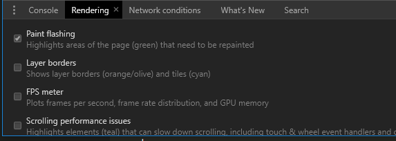

# Know your Browser

I will be mainly focusing on the _Chrome_ DevTools here but the _FireFox_ one is as valid and has interesting features of its own to discover. 

# Console 

By pressing `Esc` in the _DevTools_ it will open the bottom panel and one of your first tools you should learn is the integrated Console. 

* Get the value of thelast operation with `$_`
* Reference the currently selected DOM element with `$0`

# UI Testing

## Paint Flashing
To easily visualize whats being rendered activate the __Paint Flashing__ feature.

## Loading Testing
Every application usually has some sort of data loading handling when fetching data to the server. Testing if the visual layout is correct can be difficult when in a local environement as there is no network latency. 

Don't worry, DevTools got you covered, artificially slow down your network! This will simulated a slow 3G connection, showing you a more realistic user-experience. 

# Random

* `Ctrl-shift-P` Open the Command Menu